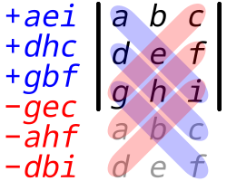

# 3. Matrices

## 3.1. Notación

* $A$ denota una matriz.
* $a_{ij}$ denota el elemento en la posición (fila $i$, columna $j$).
* $A_k$ denota la columna $k$, y entonces si $A$ tiene $n$ columnas, $A = (A_1, A_2, ..., A_n)$.

## 3.2. Operaciones entre Matrices

* **Igualdad:** Dos matrices son iguales si son iguales posición a posición.
* **Adición:** Dos matrices de las mismas dimensiones se suman posición a posición. Esto genera una matriz de la misma dimensión.
  
  Propiedades:
  * Es asociativa.
  * Es conmutativa.
  * La matriz que contiene todos sus elementos nulos para el cuerpo $\mathbb{K}$ sobre el que está definida la matriz es el elemento neutro de esta operación.
  * Para toda matriz existe su inversa aditiva (aquella que al sumar las dos se obtiene la matriz nula).

Sean $A$, $B$ matrices y $\lambda$, $\mu$ escalares.

* **Multiplicación por escalar:** Se multiplica cada posición por el escalar.
  
  Propiedades:
  * $\lambda (A + B) = \lambda A + \lambda B$
  * $(\lambda + \mu) A = \lambda A + \mu A$
  * $(\lambda \mu) A = \lambda (\mu A)$

Sean las matrices $C$ de dimensión $n \times m$, $D$ de dimensión $m \times p$ y  $E$ de dimensión $n \times p$.

* **Multiplicación de matrices:** Se multiplica cada elemento de la fila $i$ de $C$ por su respectivo en la columna $j$ de $D$. Se suman todos los productos realizados. El resultado va en la posición $i$,$j$ de $E$. Se repite $\forall \space 1 \le i \le n \space \forall \space 1 \le j \le p$.
  $$
  e_{ij} = \sum_{k = 1}^{m} c_{ik} d_{kj}
  $$

  Propiedades:
  * Es necesario que la matriz de la izquierda tenga la misma cantidad de columnas que la cantidad de filas de la de la derecha.
  * El resultado es una matriz que tiene la misma cantidad de filas que la de la izquierda, y la misma cantidad de columnas que la de la derecha.
  * **No es conmutativo**.
  * Es asociativo (siempre manteniendo el orden).
  * Es distributivo respecto de la suma de matrices (siempre manteniendo el orden).
* **Potenciación de matrices:** $A^n$ = $AAA...A$, un total de $n$ veces.
  
  Propiedades:
  * $A^{p + q} = A^p A^q$
  * $(A^p)^q = A^{pq}$

## 3.3. Matriz Transpuesta

Cada elemento $i$,$j$ en la matriz original ocupa la posición $j$,$i$ en la transpuesta. Las filas se transforman en las columnas y viceversa. Si la matriz es de dimensión $n \times p$, queda de $p \times n$.

### 3.3.1. Propiedades
1. $(A^T)^T = A$
2. $(A + B)^T = A^T + B^T$
3. $(\lambda A)^T = \lambda A^T$
4. $(AB)^T = B^T A^T$

## 3.4. Matriz Identidad

Tiene unos en la diagonal (todo elemento donde $i = j$) y ceros en todos los otros elementos. Se la denota $I$. Como siempre es cuadrada ($n \times n$), la notación $I_n$ indica, además, la dimensión. Cumple que:
$$
A I = I A = A
$$

## 3.5. Matriz Inversa

Una matriz $A$ es invertible cuando:

* Es cuadrada (dimensión $n \times n$).
* Su determinante es distinto de cero.

Las matriz $A$ y su inversa $A^{-1}$ son ambas de la misma dimensión ($n \times n$), y cumplen:
$$
A A^{-1} = A^{-1} A = I_n
$$

Cuando no es cuadrada, se habla de **pseudoinversa** (viene más adelante).

### 3.5.1. Propiedades

1. $A^{-1}$ es única para toda $A$.
2. $(A^{-1})^{-1} = A$
3. Sea $\lambda$ un escalar no nulo: $(\lambda A)^{-1} = \frac{1}{\lambda} A^{-1}$
4. $(AB)^{-1} = B^{-1} A^{-1}$

## 3.6. Matrices con Nombre Propio

Ciertas matrices reciben un nombre especial si cumplen alguna propiedad. Se enumeran los nombres y lo que tienen que cumplir para serlo.

* **Matriz Simétrica:** $A = A^T \iff a_{ij} = a_{ji}$
* **Matriz Antisimétrica:** $A = -A^T \iff a_{ii} = 0$
* **Matriz Triangular Superior:** $a_{ij} = 0 \space \forall i \gt j$ (abajo a la izquierda llena de ceros).
* **Matriz Triangular Inferior:** $a_{ij} = 0 \space \forall i \lt j$ (arriba a la derecha llena de ceros).
  * No es un error. El nombre es al revés de lo intuitivo. En realidad habla de donde hay elementos no nulos más que de donde hay ceros, pero es más fácil reconocerlas por los ceros.
* **Matriz Diagonal:** Todos los elementos que no estén en la diagonal son cero. No implica que no pueda haber ceros en la diagonal. La matriz nula es diagonal, por ejemplo.
* **Matriz Escalar:** $A = k I_n$ para algún $k$ (es la identidad multiplicada por un escalar).
* **Matriz Idempotente:** $A^2 = A$, entonces resulta: $A^n = A \space \forall n \in \N$
* **Matriz Involutiva:** $A^2 = I$, entonces resulta:
  * $A^{2n} = I$
  * $A^{2n + 1} = A$
* **Matriz Nilpotente:** Si $A^n$ es la matriz nula $\forall n \ge n_0$, $n_0$ es el índice de nilpotencia.
* **Matriz Ortogonal:** $AA^T = A^TA = I_n$

## 3.7. Forma Multilineal Alternada

Es una función $f$ que toma matrices cuadradas y devuelve escalares, que cumple:

1. $f(A_1, ..., A_i + B_i, ..., A_n) = f(A_1, ..., A_i, ..., A_n) + f(A1, ..., B_i, ..., A_n)$
2. $f(A_1, ..., \lambda A_i, ..., A_n) = \lambda f(A_1, ..., A_n)$
3. $f(A_1, ..., A_i, ..., A_i, ..., A_n) = 0$ (si hay columnas duplicadas da cero)

> **Cuidado:** la segunda condición implica que al hacer $\lambda \cdot det(A)$ esto **NO** es lo mismo que $det(\lambda A)$, sino que se multiplica solo una de las columnas al "meter el escalar para adentro".
>
> En cambio, se cumple que si $A$ tiene $n$ columnas, $det(\lambda A) = \lambda^n det(A)$.

Como consecuencias, se cumple que:

1. $f(A_1, ..., A_{i-1}, 0, A_{i+1}, ..., A_n) = 0$

    (Si una columna tiene todos ceros la función da cero)

2. $f(A_1, ..., A_i, ..., A_j, ..., A_n) = -f(A_1, ..., A_j, ..., A_i, ..., A_n)$ 

    (Intercambiar dos columnas cambia el signo)

3. $f(A_1, ..., A_i + \alpha A_j, ..., A_n) = f(A_1, ..., A_i, ..., A_n)$

    (Si a una columna $A_i$ le sumás un múltiplo escalar de otra columna $A_j$, el valor de la función no se altera)

4. Si $A_i = \sum_{j=1}^{n} \alpha_j A_j \, , \, j \neq i \implies f(A_1, ..., A_i, ..., A_n) = 0$

    Si una columna $A_i$ es combinación lineal de las demás columnas (es decir, se puede expresar como la suma de las otras columnas multiplicadas por escalares $\alpha_j$), entonces la función evaluada en esa matriz da como resultado cero. Esto es una consecuencia directa de las propiedades anteriores.

## 3.8. Determinante

El determinante de una matriz $A$, notado $det(A)$, $|A|$, $D(A)$ o $d(A)$ es la única función multilineal alternada que cumple $f(I_n) = 1$.

Como es una función multilineal alternada, cumple las 4 propiedades de más arriba.

### 3.8.1. Menor de un elemento

Sea una matriz $A$ de dimensión $n \times n$, se define el menor de un elemento como la matriz $M_{ij}$ de dimensión $(n - 1) \times (n - 1)$ que se obtiene eliminando de $A$ la fila $i$ y la columna $j$ (similar a "tapar" una fila y una columna, algo que se hace como "truco" para calcular un producto vectorial de $3 \times 3$).

### 3.8.2. Cofactor de un elemento

Se define el cofactor del elemento en la posición $(i, j)$ de la matriz $A$, y se lo nota $A_{ij}$, como:

$$
A_{ij} = (-1)^{i + j} det(M_{ij})
$$

donde $M_{ij}$ es el menor del elemento $(i, j)$.

### 3.8.3. Cálculo del determinante

Siguiendo los conceptos anteriores, se calcula el determinante con la **Regla de Laplace**, que dice que:

$$
det(A) = \sum_{j = 1}^{n} a_{ij} A_{ij}
$$

donde $a_{ij}$ es el elemento en la posición $(i, j)$ y $A_{ij}$ su cofactor.

* Para matrices de $2 \times 2$ conviene aplicar $a_{11} a_{22} - a_{21} a_{12}$
* Para matrices de $3 \times 3$ conviene aplicar la Regla de Sarrus.

  

* Para matrices de mayores dimensiones, el cálculo es largo, ya que es recursivo.

---

## 3.9. Traza

La traza de una matriz $A$ **cuadrada**, $tr(A)$, es la suma de los elementos de toda la diagonal.
