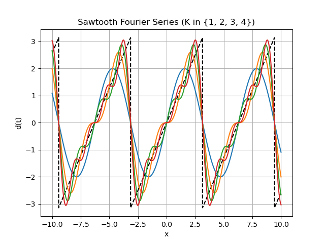
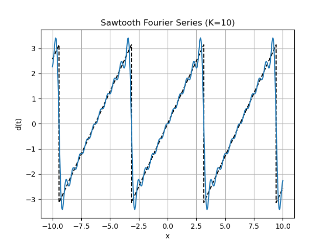

# 12. Introducción a la Serie de Fourier

Toda función periódica puede expresarse como una sumatoria infinita de funciones periódicas más simples (senos y cosenos). Esto permite descomponer señales complejas en sus frecuencias puras, formando la base fundamental del análisis espectral en ingeniería.

## 12.1. Intuición Analítica

Observamos gráficamente que las ondas periódicas pueden aproximarse sumando una onda fundamental y sus armónicos (ondas de frecuencias múltiplos de la fundamental). La señal puede seguir aproximándose iterativamente agregando armónicos. Cuanto mayor sea el número de armónicos que se suman, más se parece la aproximación a la señal original. No obstante, esta aproximación no es exacta en los bordes donde hay cambios bruscos, pero sí en casi todos los puntos intermedios. Este fenómeno se conoce como **fenómeno de Gibbs**, y se debe a que la serie de Fourier converge puntualmente en los puntos de continuidad, pero no uniformemente en las discontinuidades.

Por ejemplo, las siguientes imágenes muestran la aproximación de una señal diente de sierra utilizando diferentes números de armónicos $K$:

  

Se observa que la aproximación es cada vez mejor a medida que aumenta la cantidad de armónicos $K$. Si se toma un valor de $K$ suficientemente grande, la aproximación es casi indistinguible de la señal original, excepto en los bordes donde hay discontinuidades "bruscas". Por ejemplo, para $K = 10$, la aproximación resulta:

  

Ver archivo `code_examples/sawtooth_fourier.py` para ver el código fuente utilizado para generar las imágenes.

## 12.2. Representación Espectral

Dada una señal periódica $s(t)$ de frecuencia $f_0$ y período $T = \frac{1}{f_0}$, la serie se simplifica usando la fórmula de Euler ($e^{i \varphi} = \cos(\varphi) + i\sin(\varphi)$) para utilizar exponenciales complejas:
$$
s(t) = \sum_{k=-\infty}^{\infty} c_k e^{i 2\pi f_0 k t}
$$
Al conjunto de coeficientes $c_k$ se lo denomina el **espectro** de la señal.

> **Nota:** Conociendo la amplitud y la fase (información contenida en los complejos $c_k$) se puede reconstruir la señal original de forma exacta. Matemáticamente, el espectro está definido también para frecuencias negativas ($k < 0$).

### 12.2.1. Ejemplo

Para la función diente de sierra $d(t) = t$ (en el intervalo $-\pi \le t < \pi$) extendida periódicamente tal que $d(t + 2\pi) = d(t)$, se obtiene el siguiente desarrollo en serie de senos:
$$
d(t) = 2 \sum_{k=1}^{\infty} \frac{(-1)^{k+1}}{k} \sin(k t)
$$
